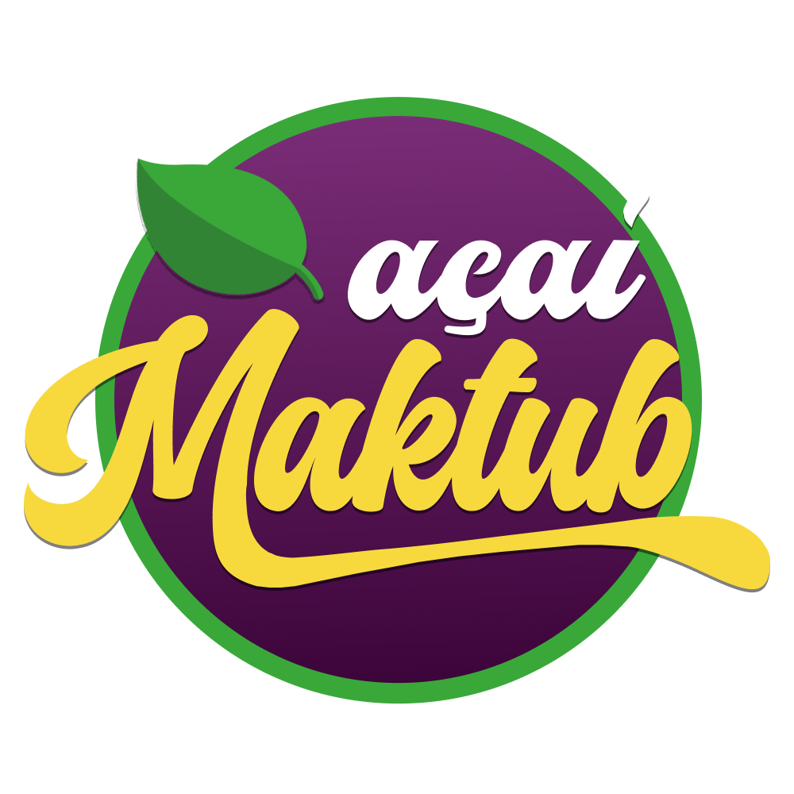

<p align='center'></p>

<p align='center'>


  
</p>

## 🚀 Tecnologias

Este projeto utiliza as seguintes tecnologias:

### Frontend

- [React](https://reactjs.org/)
- [Next.js](https://nextjs.org/)
- [React-Redux](https://react-redux.js.org/)

### Backend

- [Node.js](https://nodejs.org/)
- [Express.js](https://expressjs.com/)
- [MongoDB](https://www.mongodb.com/)
- [Mongoose](https://mongoosejs.com/)

## 📜 Descrição

Este projeto consiste em uma aplicação web para gerenciar informações sobre Açaís. O frontend é desenvolvido em React com Next.js para renderização no lado do servidor, enquanto o backend utiliza Node.js com Express.js para criação de APIs RESTful. O MongoDB é utilizado como banco de dados, com o Mongoose para modelagem de dados.

## ⚙️ Como funciona?

A aplicação oferece funcionalidades para criação, listagem, atualização e remoção de registros de Açaí. Utiliza comunicação entre frontend e backend via APIs RESTful.

## Frontend

### Componentes Principais

- **Header**: Componente de navegação com links para Home, Produtos e Sobre.
- **Card**: Componente para exibição de informações de Açaí.
- **Modal**: Componente para adição e edição de registros de Açaí.

### Funcionalidades

- **Listagem de Açaís**: Exibe todos os Açaís cadastrados.
- **Criação de Açaí**: Permite adicionar novos registros de Açaí.
- **Edição de Açaí**: Permite modificar informações de registros existentes.
- **Exclusão de Açaí**: Permite remover registros de Açaí.

## Backend

### Rotas Principais

- **POST** `/api/acai`: Cria um novo registro de Açaí.
- **GET** `/api/acai`: Retorna todos os registros de Açaí.
- **PUT** `/api/acai/:id`: Atualiza um registro de Açaí existente pelo ID.
- **PATCH** `/api/acai/:id/price`: Atualiza apenas o preço de um registro de Açaí pelo ID.
- **DELETE** `/api/acai/:id`: Deleta um registro de Açaí pelo ID.

## 🎲 Como rodar o projeto?

### Clone esse repositório

```bash
git clone https://github.com/junioorcwb/Acaiteria.git
```

## Back-end

### Navegue até o diretório do projeto

```bash
cd Acaiteria
```

### Navegue até o diretório back-end

```bash
cd back-end
```

### Instale as dependências

```bash
npm i
```

```bash
yarn
```

### Inicie a aplicação

```bash
npm run dev
```

## Front-end

### Navegue até o diretório front-end

```bash
cd front-end

```

### Instale as dependências

```bash
npm i
```

```bash
yarn
```

### Inicie a aplicação

```bash
npm run dev
```
